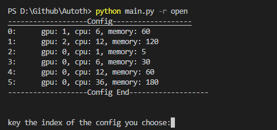
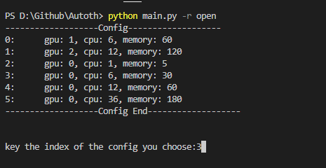
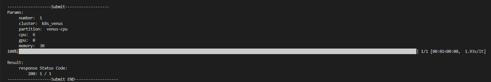
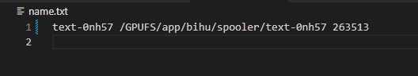

### <center>AutoTh脚本使用说明</center>

#### 一、脚本说明

​		本脚本通过爬取天河平台前端发起开启作业、关闭作业时向后端发起的请求（包括请求方式POST/GET/DELETE, 请求头headers, 和请求参数payload）在脚本中模拟客户在浏览器端发起请求，实现了自定义名称的批量开启作业、根据指定机器名批量关闭作业功能。脚本提供的参数如下：

```
usage: main.py [-h] [-r R]
optional arguments:
  -h, --help  show this help message and exit
  -r R        open, close
```


#### 二、脚本运行方式

- 开启作业

  - 在`userFunction.py`中自定义开启的机器名

    本次脚本给出了使用者自定义的一些函数的接口，定义在`userFunction.py`中，目前已给出的有`get_open_job_name`和`get_close_job_name`两个函数。

    开启机器时，使用者可自定义修改`get_open_job_name`函数中的内容，返回值必须是形如[机器名，机器名，....，机器名]的`list`

    ```python
    def get_open_job_name():
        # 这里写自己想要的机器名列表
        # 示例：
        # jobname = ["text-{}".format(i) for i in range(100)]
        return jobname
    ```

  - shell输入命令`python main.py -r open`

    

  - 输入选择配置对应的序号以选择要开启的机器的配置

    

  - 启动成功



​			同时，开启作业成功后会在本地保存一个用于记录机器名、机器工作目录、机器shell url前缀的`name.txt`



- 关闭作业

  - 在`userFunction.py`中自定义要关闭的机器名

    为了防止误关闭他人开启的机器，使用者需给出要关闭的机器所对应的名字。

    使用者可自定义修改`get_close_job_name`中的内容，返回值必须是形如[机器名，机器名，....，机器名]的`list`

    ```python
    def get_close_job_name():
        # 这里写自己想要删除的机器名列表
        # 示例： 从保存的name.txt中读取所有机器名
        with open("name.txt", 'r', encoding='utf-8') as f:
            machine_data = f.read().split("\n")
            f.close()
        while (True):
            try:
                machine_data.remove('')
            except:
                break
        machine_data = [data.split(" ")[0] for data in machine_data]
        return machine_data
    ```

​			  `name.txt`可被利用至此处快速 删除所有之前开启的机器，如需保留部分机器，可手动修改`name.txt`或在代码中自定义生成方法。

#### 三、脚本问题

​		当前脚本会出现开启机器后如从浏览器进入机器管理界面，下方的shell入口和ssh网址为null的情况，但不影响直接通过`name.txt`中保存的信息进入shell或者ssh远程连接。

​		其中`name.txt`的保存格式为形如`text-0nh57 /GPUFS/app/bihu/spooler/text-0nh57 263513`的`机器名 机器目录 url前缀`

​		其中最后的数字可用于：

- `http://数字.proxy.nscc-gz.cn:8888/`用于访问shell
