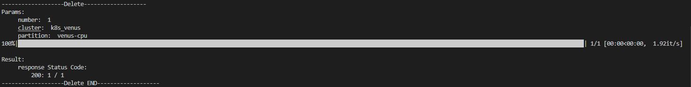

### <center>AutoTh脚本使用说明</center>

#### 一、脚本说明

​		本脚本通过爬取天河平台前端发起开启作业、关闭作业时向后端发起的请求（包括请求方式POST/GET/DELETE, 请求头headers, 和请求参数payload）在脚本中模拟客户在浏览器端发起请求，实现了自定义名称的批量开启作业、根据指定机器名批量关闭作业等功能。脚本提供的参数如下：

```
usage: main.py [-h] [-r R]
optional arguments:
  -h, --help  show this help message and exit
  -r R        open, close
  -e          execute shell or not
  -d          delete storage or not
```


#### 二、脚本运行方式

- 开启作业

  - 在`userFunction.py`中自定义开启的机器名

    **本次脚本给出了使用者自定义的一些函数的接口，定义在`userFunction.py`中。**

    开启机器时，使用者可自定义修改`get_open_job_name`函数中的内容，返回值必须是形如[机器名，机器名，....，机器名]的`list`

    ```python
    def get_open_job_name():
        # 这里写自己想要的机器名列表
        # 示例：
        # jobname = ["text-{}".format(i) for i in range(100)]
        return jobname
    ```

  - shell输入命令`python main.py -r open`

    

  - 输入选择配置对应的序号以选择要开启的机器的配置

    

  - 启动成功


​			同时，开启作业成功后会在本地保存一个用于记录机器名、机器工作目录、机器shell url前缀的`name.txt`


- 关闭作业

  - 在`userFunction.py`中自定义要关闭的机器名

    为了防止误关闭他人开启的机器，使用者需给出要关闭的机器所对应的名字。

    使用者可自定义修改`get_close_job_name`中的内容，返回值必须是形如[机器名，机器名，....，机器名]的`list`

    ```python
    def get_close_job_name():
        # 这里写自己想要删除的机器名列表
        # 示例： 从保存的name.txt中读取所有机器名
        with open("name.txt", 'r', encoding='utf-8') as f:
            machine_data = f.read().split("\n")
            f.close()
        while (True):
            try:
                machine_data.remove('')
            except:
                break
        machine_data = [data.split(" ")[0] for data in machine_data]
        return machine_data
    ```
  
  ​		`name.txt`可被利用至此处快速 删除所有之前开启的机器，如需保留部分机器，可手动修改`name.txt`或在代码中自定义生成方法。
  
  - shell输入命令`python main.py -r close`，删除成功
  



- 连接shell以运行shell启动脚本

  该功能作为打开机器功能的附属功能，通过`-e`参数传入，即运行

  ```
  python main.py -r open -e
  ```

  在打开机器之后，在天河平台上于~/.zshrc中编写shell启动脚本。当前脚本通过`WebSocket`与天河后台`socket`接口进行交互，达到模拟在浏览器上打开shell界面以此运行shell启动脚本。

  使用者可自定义修改`get_url()`，`operate_process()`函数。

  `get_url()`给定想要访问的shell url的前缀，可结合`name.txt`使用

  ```python
  def get_url():
      # 这里得到shell的url前面的前缀数字列表
      # 如http://260547.proxy.nscc-gz.cn:8888/ 前面的260547
      with open("name.txt", "r", encoding="utf-8") as f:
          machine_data = f.read().split("\n")
          f.close()
      while (True):
          try:
              machine_data.remove('')
          except:
              break
      url = [data.split(" ")[2] for data in machine_data]
      return url
  ```

  `operate_process(autoth)`给出运行完shell启动脚本后所要的事情，下面给出一个例子：

  在天河~/.zshrc中编写脚本使得shell启动后当前机器会在家目录下创建一个`ip/{机器ip}`的文件，本脚本已提供`get_ip()`接口来得到不同机器家目录`ip/`目录下的文件名（即ip），通过在`operate_process()`中编写如下代码：

  ```python
  def operate_process(autoth):
      # 自定义在连接shell后，机器运行shell启动脚本后后续要做的操作
      machine_name = get_close_job_name()
      url_dic = {name: 'https://starlight.nscc-gz.cn/api/storage/dir_info?dir=/GPUFS/app/bihu/spooler/{}/ip&sort_key=time&order_by=desc'.format(name) for name in machine_name}
      ip_dic = {}
      for name in url_dic:
          url = url_dic[name]
          ip = autoth.get_ip(url)
          ip_dic[name] = ip
      with open("ip.txt", 'w', encoding="utf-8") as f:
          for name in ip_dic:
              f.write("{} {}\n".format(name, ip_dic[name]))
  ```

  上述代码可以在本地生成一个`ip.txt`其中每一行为形如`text-02dez 192.168.32.53` ，`机器名 机器ip`

- 删除家目录的文件夹

  该功能作为关闭机器功能的附属功能，通过参数`-d`传入，即运行：

  ```
  python main.py -r close -d
  ```

  如上面所讨论的，我们可以在天河每台机器的家目录下创建文件夹如`ip/`，该功能可以将给定名称的所有机器的家目录下的某些文件夹删除。

  通过在`get_dir_name()`中给定所要删除的文件夹名列表，返回值必须是形如`[文件夹名，文件夹名...]`的`list`

  ```python
  def get_dir_name():
      # 这里写自己想要删除的文件夹名列表
      return ["ip"]
  ```

  同时通过上述`get_close_job_name()`给出要关闭并删除文件夹的机器名

#### 三、脚本问题

​		当前脚本会出现开启机器后如从浏览器进入机器管理界面，下方的shell入口和ssh网址为null的情况，但不影响直接通过`name.txt`中保存的信息进入shell或者ssh远程连接。

​		其中`name.txt`的保存格式为形如`text-0nh57 /GPUFS/app/bihu/spooler/text-0nh57 263513`,`机器名 机器目录 url前缀`

​		其中最后的数字可用于：

- `http://数字.proxy.nscc-gz.cn:8888/`用于访问shell


​		如果和天河平台的socket连接出现问题，会导致连接shell以运行shell启动脚本功能无法完成。
