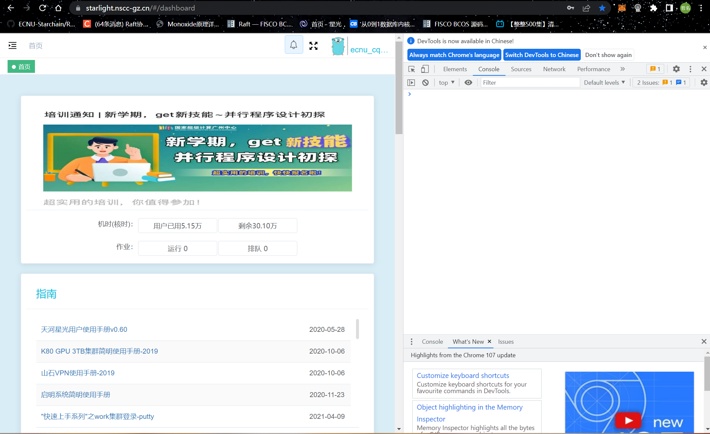
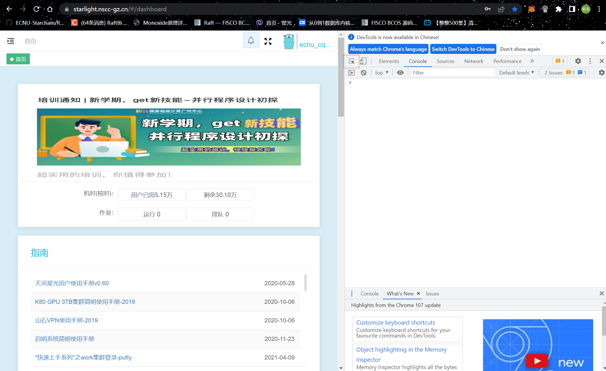
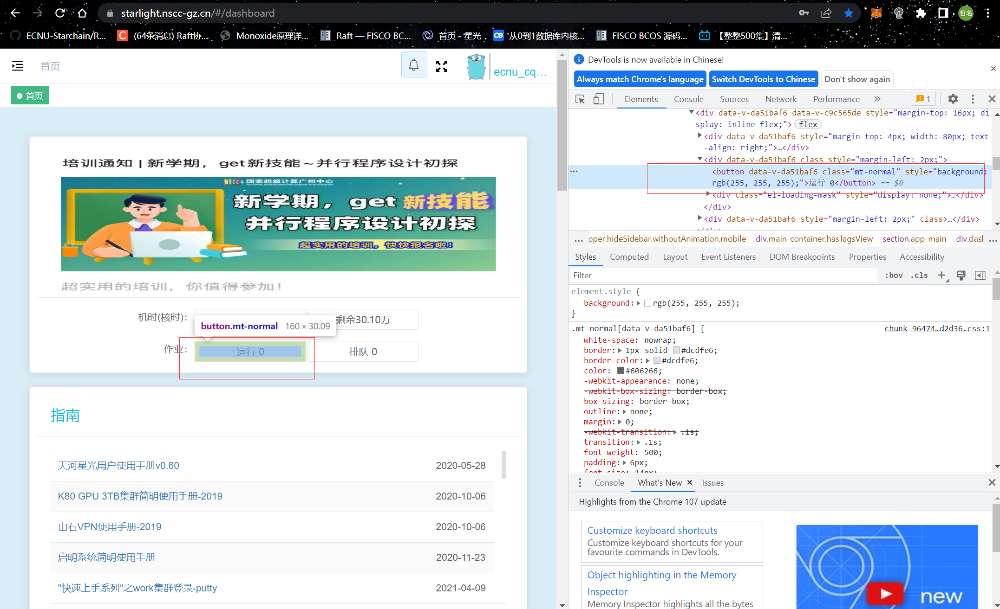
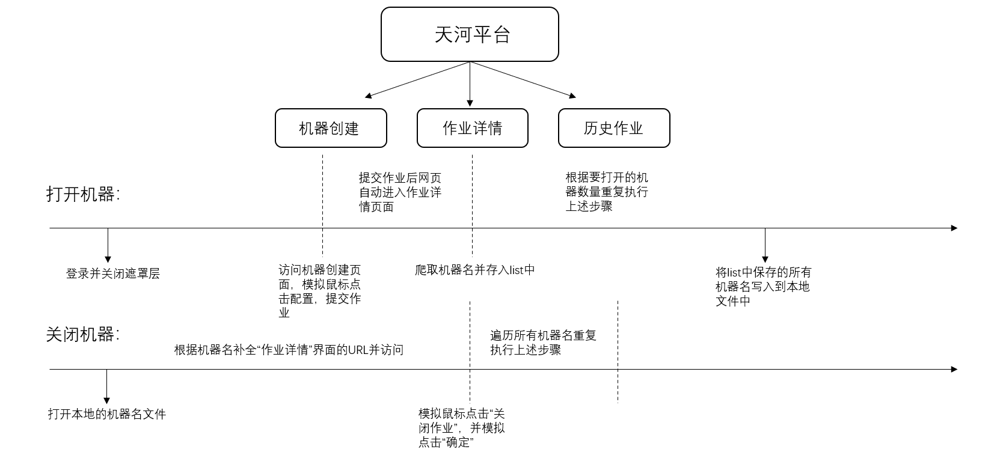
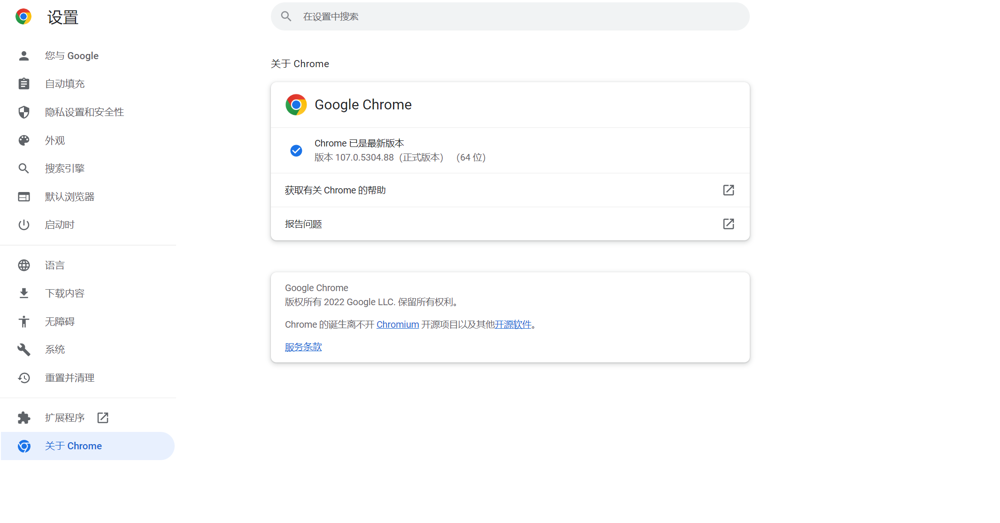

### <center>README</center>

#### 一、使用环境

- 编程语言：python(3.9)

- 核心依赖库：

  - selenium

    ```
    pip install selenium
    ```

- 浏览器要求：Chrome浏览器

#### 二、脚本原理

​		Selenium是一个用于Web应用程序测试的工具。Selenium测试直接运行在浏览器中，就像真正的用户在操作一样。由于天河平台大部分网页的网页布局时固定的，所以可以通过网页中某些元素的`xpath`来得到该元素并通过模拟鼠标点击、键盘输入来达到自动化测试的目的。

​		要获取网页中某一个元素的`xpath`，可以通过如下方式：

- [ ] `F12`打开浏览器控制台



- [ ] 点击选择元素按钮（Ctrl + Shift + C）



- [ ] 点击想要获取的元素



- [ ] 右键点击右侧选中区域，选择Copy-Copy XPath即可获得XPath至剪贴板


​		除了`Xpath`之外，一个HTML网页中的元素往往还会有自己的`id`,`class`,`style`等，也可以通过这些特点选出元素，其中`id`往往可以固定选出某个元素，而`class`,`style(css)`可能选出多个元素，在脚本中需要给出对应的下标才能确定。也可以通过选择器(`selector`)的的方式选择，但是选择器得到的”路径“往往较复杂，且有时也需要下标。通常最常使用的就是`id`和`XPath`。

​		如果网页出现遮罩层，比如天河平台登录后会出现一个引导框，此时整个HTML会出现一个`width`和`height`均为`100%`的黑色半透明`div`置于最上层遮挡其它元素(如通过`css`设置`z-index`达到最上层的目的)，会出现`XPath`无法选出结果的情况，此时要先关闭遮罩层再进行选择。

​		基于上述操作，可以得到批量开关机器的流程如下：



​		类似上面的流程还可以实现其他的功能。

#### 三、ChromeDriver下载

​	使用chromedriver.exe才可以运行自动化测试软件，且需要和当前Chrome浏览器版本匹配

- 查看Chrome版本

  打开Chrome浏览器【设置】【关于Chrome】即可查看当前版本

  

- 下载`ChromeDriver`

  http://chromedriver.storage.googleapis.com/index.html

  根据上面的浏览器版本找到对应的可兼容的`ChromeDriver.exe`

- 修改脚本中的路径

  打开脚本`operate.py`，修改157行为`driver = webdriver.Chrome(executable_path=你的ChromeDriver路径)`

#### 四、脚本功能

- 批量打开机器`open_machine`

  params: [number:打开机器的数量, save_name: 是否保存当前开启的机器名, save_path: 机器名文件保存路径]

  该函数可以批量创建指定数量的指定配置的Ubuntu18.04机器，并指定是否将开启的机器的名字保存到本地文件中

  指定的配置一定要符合天河平台上的配置，如果需要gpu，则在命令行中输入`-g`，然后根据需要的cpu数输入`-c cpu数`即可，其中`24核/4块/240GB`似乎因为配额问题无法使用，所以在编写脚本时未列入。

  关于保存机器名的原因见close_machine函数

- 批量关闭机器`close_machine`

  params: [file_path: 机器名文件路径]

  该函数可以对指定名称的机器进行批量关闭。

  考虑到如果直接使用xpath来关闭机器，可能会关闭其他人开启的机器(无法在前端区分)，所以最好是给出一个"我"开启的机器名，然后一一关闭。机器名文件由open_machine函数保存得到，可以通过open_machine中的save_path来更改路径，默认为'name.txt'

- 删除存储`delete_memory`

  params: [file_path: 机器名文件路径, delete_dir_name: 删除的文件夹名]

  该函数只适用于`/GPUFS/app/bihu/spooler/机器名/`只有一个文件夹，用于删除已停止的作业中`/GPUFS/app/bihu/spooler/机器名/`下未删除的文件以释放磁盘空间。

  <strong>在使用此脚本时，创建完机器进行实验时尽可能在上述目录下先创建一个统一的文件夹，在该文件夹下进行实验</strong>

- 批量打开浏览器上的shell并统一输入命令`key_bash`

  params: [file_path: 机器名文件, bash_content: 输入的命令]

  该函数可以批量打开指定名称的机器对应的`shell`并向其中输入命令

  这里可以在机器根目录(所有机器共用)下先写一个.sh文件，将要执行的命令写在里面,然后统一输入'bash .sh'来达到类似统一启动的效果

  <strong>当前脚本124行time.sleep(10)是因为有autojump的安装过程，如果没有，注释即可</strong>


- 其它延申功能（举例，可能有更好的实现方法）

  在天河平台进行实验时往往需要开启多台机器并部署多机网络环境，此时需要得到各机器的`ip`（配置网络）与机器名（有时候需要`scp`到含有机器名的家目录`/GPUFS/app/bihu/spooler/`机器名中）,且需要将`ip`与机器名一一对应。而由于在天河平台没有`sudo`权限所以难以做到开机自启动脚本的功能，可以通过在根目录`~`下创建一个特定的文件夹如`ip`然后编写一个`.sh`脚本`ifconfig >> ip/ip.txt && ls /GPUFS/app/bihu/spooler >> ip/name.txt`然后运行一个`python`或其它脚本对`ip.txt`和`name.txt`中的内容进行读取与处理最后得到一个名为`机器ip`内容为`机器名`的文件最后`rm -rf ~/ip/ip.txt && rm -rf ~/ip/name.txt`。这样该`.sh`文件就可以实现每台机器运行该文件后得到一个以该机器ip为名，以该机器名为内容的文件，然后通过上述`key_bash`功能对每台机器的浏览器shell输入`bash 脚本.sh`即可在根目录下生成所有机器的内容为机器名的名为ip的文件。

#### 五、运行方法

```
usage: operate.py [-h] [-r R] [-n N] [-p P] [-s] [-b B] [-d D] [-c C] [-g]

optional arguments:
  -h, --help  show this help message and exit
  -r R        open, close, delelte, key
  -n N        machine number
  -p P        file path to save names
  -s          save names or not
  -b B        bash content to key
  -d D        dir name to delete
  -c C        cpu number
  -g          use gpu or not
```

- 打开机器示例（4台）

  ```
  python operate.py -r open -n 4 -s -c 6# 打开4台机器(0gpu6cpu)并保存机器名
  python operate.py -r open -n 4 -s -g -c 6 打开4台机器(1gpu6cpu)并保存机器名
  ```

- 关闭机器示例

  ```
  python operate.py -r close	 # 关闭name.txt包含的机器
  ```

- 删除存储空间示例

  ```
  python opeate.py -r delete -d fisco # 删除name.txt包含的机器中的/GPUFS/app/bihu/spooler/机器名/fisco文件夹
  ```

- 输入命令示例

  ```
  python operate.py -r key -b ls # 打开name.txt包含的机器对应的shell并输入ls
  ```


#### 六、问题

​		由于网页加载速度慢可能导致脚本运行时元素还未加载出来从而无法通过`XPath`得到元素，所以脚本中使用了很多`time.sleep(..)`来保证元素被完全加载。同时如果因为网络连接问题导致脚本运行到一半网页无法继续访问与加载，刷新后可能导致脚本陷入死循环。这一问题暂时没有想到办法解决，暂时通过`tqdm`对脚本进度进行了可视化，如果出现脚本无法继续运行的情况，可以通过`tqdm`中显示的当前脚本进行到第几台机器作为新一次脚本的开始机器([index:])重新运行脚本，因为上面实现的功能（除`key_bash`延申的自定义脚本功能）各机器之间独立，所以重新运行应该不会对之前已经运行成功的机器造成影响。

​		